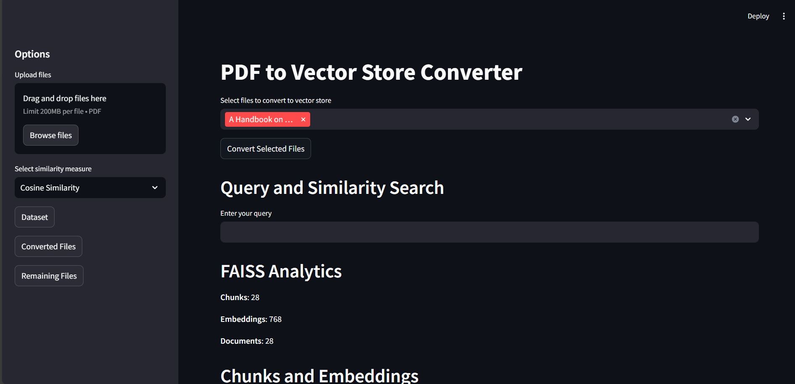
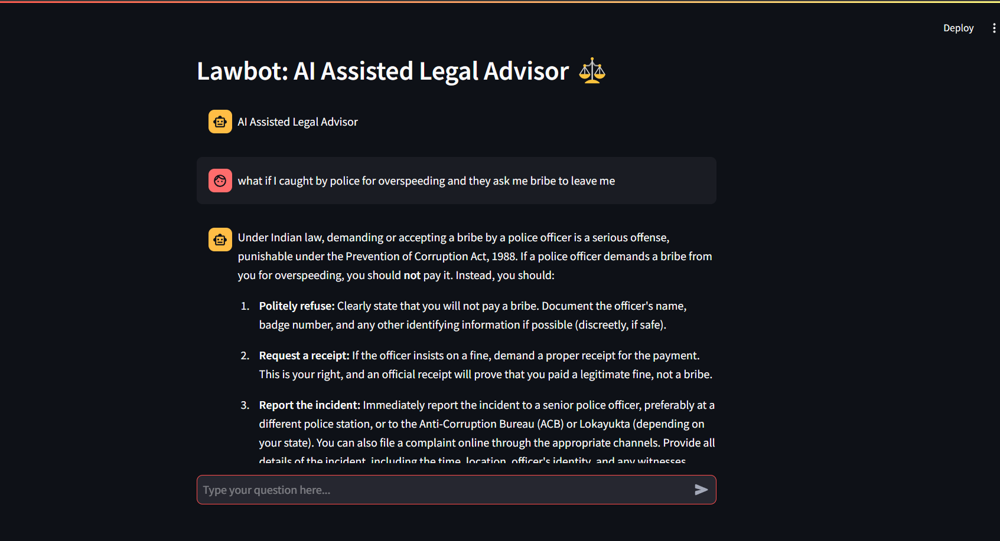

# LawBot: AI-Powered Legal Assistance for Indian Laws ⚖️  

Welcome to **LawBot** – your AI-powered legal advisor specializing in Indian laws! With cutting-edge AI, **LawBot** leverages **Google’s advanced AI models** and modern NLP techniques to provide precise, context-aware legal guidance. Whether you're seeking information on legal procedures, rights, or regulations in India, **LawBot** is here to assist you.  

> **Disclaimer:** AI models may occasionally produce inaccurate information. Use LawBot as a supplementary tool, not as a substitute for professional legal counsel.  

---

## **Technology Stack** 💻  

  

  

  

  


---

## **Features** ✨  

- 💬 **Conversational AI**: Get tailored responses to legal queries using natural language.  
- 📂 **Legal Document Analysis**: Extract, classify, and retrieve insights from PDFs and other legal documents.  
- 🔍 **Intelligent Search**: Powered by **FAISS** for accurate and fast legal research.  
- 🌐 **Streamlit Interface**: A user-friendly interface for seamless interactions.  
- 🔄 **RAG Framework**: Combines retrieval and generative capabilities to ensure precision and context in answers.  

---

## **System Architecture** 🛠️  

  

### **Key Components**:  

1. **Data Ingestion**:  
   - Extract text from PDF files stored in the `dataset` folder.  
   - Preprocess the text into manageable chunks.  
   - Create embeddings using **FAISS** for fast and accurate retrieval.  

2. **Retrieval-Augmented Generation (RAG)**:  
   - Combines vector-based search (**FAISS**) with generative models.  
   - Finds relevant documents and uses **Google Generative AI** to craft answers.  

3. **Conversational Interface**:  
   - Built with **Streamlit** for a seamless, interactive user experience.  
   - Users input queries, and LawBot delivers accurate, context-aware responses.  

4. **Enhancements**:  
   - **Gemini API**: Augments document analysis for deeper insights.  

---

## **How It Works** 🔍  

### **1. Data Ingestion**  
- Extract and preprocess text from legal PDFs stored in the `dataset` directory.  
- Create a FAISS-based vector store to index legal content efficiently.  

### **2. Question Answering**  
- Users ask legal questions through the interface.  
- LawBot uses FAISS to retrieve the most relevant document chunks.  
- Answers are generated using **RAG** methods, combining search results with generative AI for accuracy.  

---

## **Setup Instructions** 🛠️  

### **1. Clone the Repository**  
```bash  
git clone <repository_url>  
cd lawbot  
```  

### **2. Set Up Virtual Environment**  
```bash  
python -m venv .venv  
source .venv/bin/activate  # Linux/Mac  
.venv\Scripts\activate     # Windows  
```  

### **3. Install Dependencies**  
```bash  
pip install -r requirements.txt  
```  

### **4. Configure Environment Variables**  
Create a `.env` file in the root directory and add the following:  
```ini  
GOOGLE_API_KEY=your_google_api_key  
MODEL_NAME=your_model_name  
```  

### **5. Run the Vector Store Creation**  
Create the FAISS vector store and generate embeddings:  
```bash  
streamlit run ingest.py  
```  



### **6. Start the Application**  
Run the main application to test LawBot:  
```bash  
streamlit run lawbot.py  
```  

---

## **Streamlit Deployment** 💡  

1. Start the app:  
   ```bash  
   streamlit run app.py  
   ```  

2. Interact with the interface:  
   - Enter legal questions in the chatbox.  
   - LawBot provides contextually accurate responses based on Indian laws.  



---

## **Made with 💡 & ❤️ by [Nagraj](https://github.com/Nagraj-13)**  